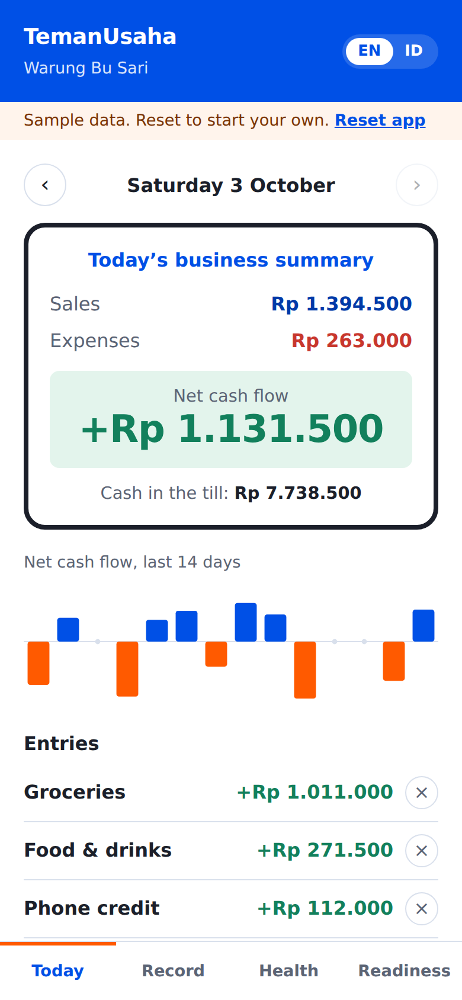
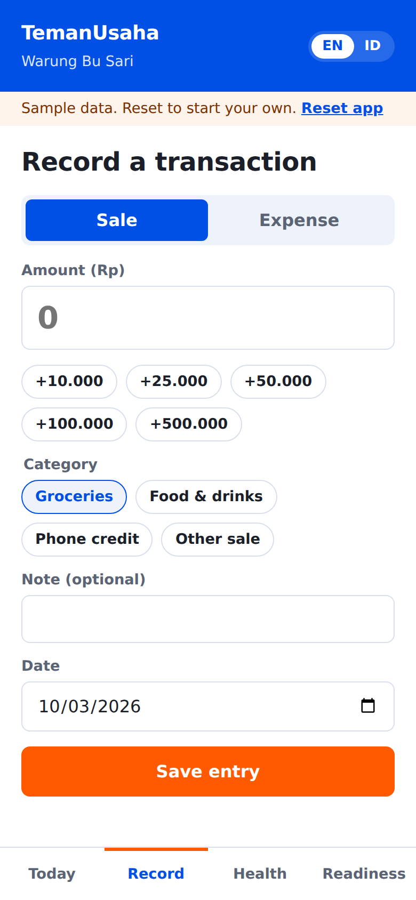
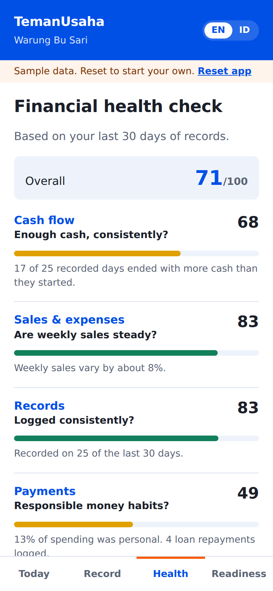
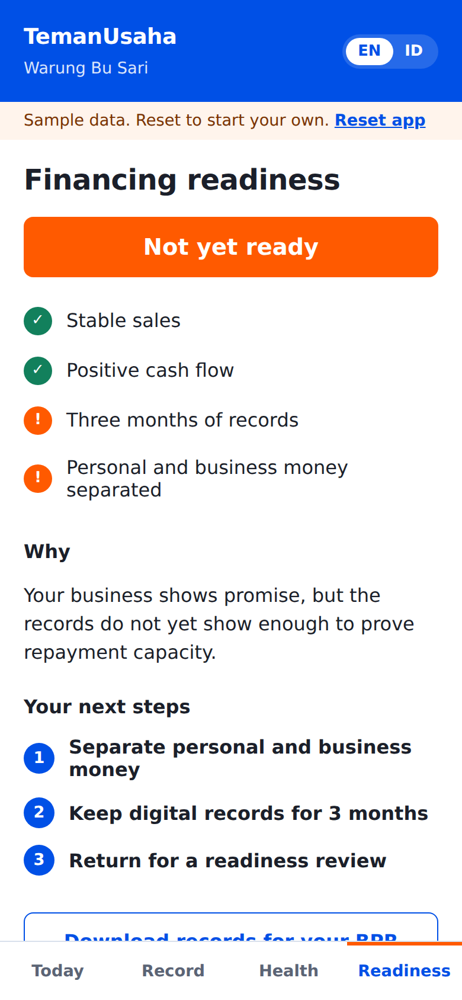

# TemanUsaha: Mobile Bookkeeping App

A mobile bookkeeping and financing readiness app for rural Indonesian merchants, built for **NTU PEAK (Monee Team 1)**.

**Live demo:** `https://vaibenz.github.io/temanusaha-bookkeeping-app/` (tap *Explore with a sample warung*)

<p>




</p>

## Why it exists

Indonesia's MSMEs face a financing gap of around US$235 billion. Rural warungs are hit hardest. They trade in cash, keep handwritten notebooks that are easy to lose and hard to use for financing, and so have no record a lender can underwrite against.

Our PEAK proposal, TemanUsaha, tackles this in three steps (Learn, Digitise, Access Finance). A finance van brings financial literacy to the village. This app turns daily trade into a digital track record. A partnership with Bank Perekonomian Rakyat (BPRs) then turns that record into credit. This repository is the **Digitise** and **Access Finance** part: the app merchants keep using after the van leaves.

## What it does

| Station from the pitch | In the app |
|---|---|
| Mobile Bookkeeping Onboarding | Set up a business profile, log sales and expenses in seconds with quick amount buttons, and see a daily summary of sales, expenses and net cash flow in rupiah, plus cash in the till and a 14-day cash flow chart. |
| Financial Health Check | Scores the four pillars from the deck over the last 30 days: **Cash flow** (share of recorded days ending positive), **Sales & expenses** (week to week sales stability), **Records** (how consistently the merchant logs) and **Payments** (personal spending mixed into the till, loan repayments logged). |
| Financing Readiness & Next Steps | Checks stable sales, positive cash flow, three months of records and separation of personal and business money, then returns *Ready*, *Almost ready* or *Not yet ready* with concrete next steps. |
| BPR partnership data | Exports every record as a CSV with a fixed column set, so each partner BPR receives the same format and the merchant's history travels with them. |

The app runs in English and Bahasa Indonesia, works on a phone screen first, and stores records only in the browser (`localStorage`). Nothing is sent to a server.

The sample warung reproduces the Station 4 card from our pitch. It has stable sales and positive cash flow, but only ten weeks of history and personal spending mixed into the till, so it lands on *Not yet ready* with three next steps.

## How readiness is scored

All rules are plain functions in [`src/lib/finance.js`](src/lib/finance.js) with unit tests in [`src/lib/finance.test.js`](src/lib/finance.test.js).

| Check | Passes when |
|---|---|
| Stable sales | Sales stability score at least 60 (weekly sales vary by under 20%) |
| Positive cash flow | Net cash flow over 30 days is positive and at least 60% of recorded days end positive |
| Three months of records | At least 90 days since the first record and logging on at least 70% of recent days |
| Money separated | Personal spending is at most 10% of expenses |

All four pass: *Ready*. One gap: *Almost ready*. Two or more: *Not yet ready*. The thresholds live in `READINESS_RULES`, so a partner BPR could tune them to its own credit policy. The companion [SME credit scoring model](https://github.com/vaibenz/sme-credit-risk-model) shows how this kind of behavioural record turns into a probability of default, a risk tier and a price.

## Run it locally

```bash
git clone https://github.com/vaibenz/temanusaha-bookkeeping-app.git
cd temanusaha-bookkeeping-app
npm install
npm run dev      # http://localhost:5173
npm test         # 9 unit tests for the finance logic
npm run build    # production build in dist/
```

## Deploy to GitHub Pages

The workflow in `.github/workflows/deploy.yml` builds and publishes the app on every push to `main`. In your repository go to **Settings, Pages** and set **Source** to **GitHub Actions**. The site appears at `https://vaibenz.github.io/temanusaha-bookkeeping-app/`.

## Tech

React 18, Vite 5 and plain CSS, with no UI library. Vitest runs the tests. Charts are hand-drawn SVG. The typeface is Plus Jakarta Sans, which was designed for Jakarta's city identity.

```
src/
├── App.jsx                  # shell, navigation, language toggle
├── components/
│   ├── Onboarding.jsx       # business profile setup
│   ├── Today.jsx            # daily summary, cash in till, 14-day chart, entries
│   ├── Record.jsx           # sale and expense entry
│   ├── Health.jsx           # four-pillar health check
│   └── Readiness.jsx        # status, checks, next steps, BPR export
└── lib/
    ├── finance.js           # summaries, health check, readiness, CSV export
    ├── finance.test.js
    ├── demoData.js          # seeded sample warung
    ├── i18n.js              # English and Bahasa Indonesia
    ├── dates.js
    └── storage.js
```

## Context

Built as part of the NTU PEAK Leadership Programme 2026 (Monee Team 1), responding to the problem statement: *How can we better utilise technology to increase access to sustainable financing for SMEs in Southeast Asia, to foster financial inclusion and long-term economic resilience?*

## License

MIT
